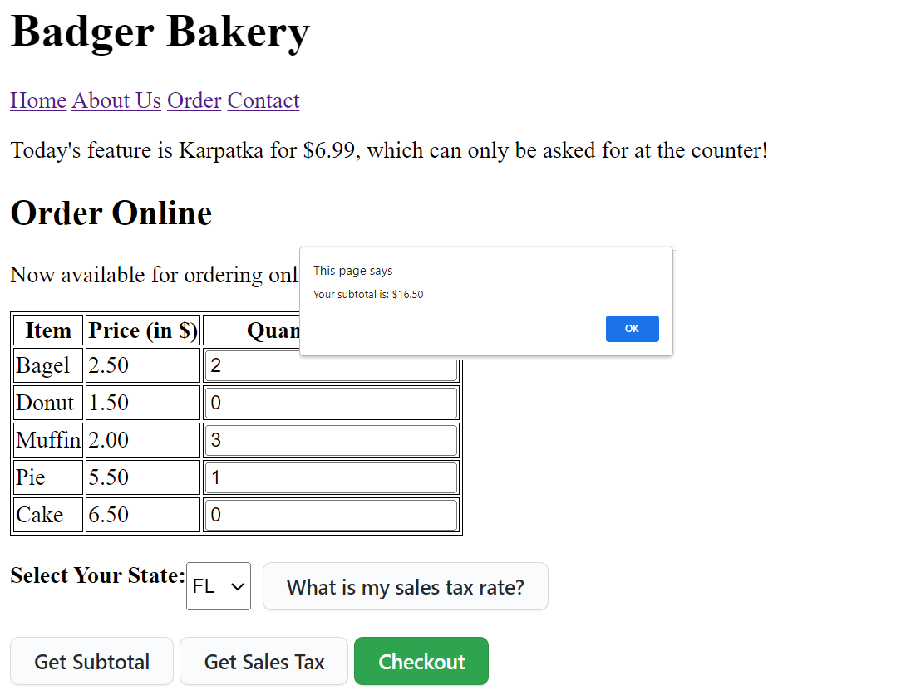
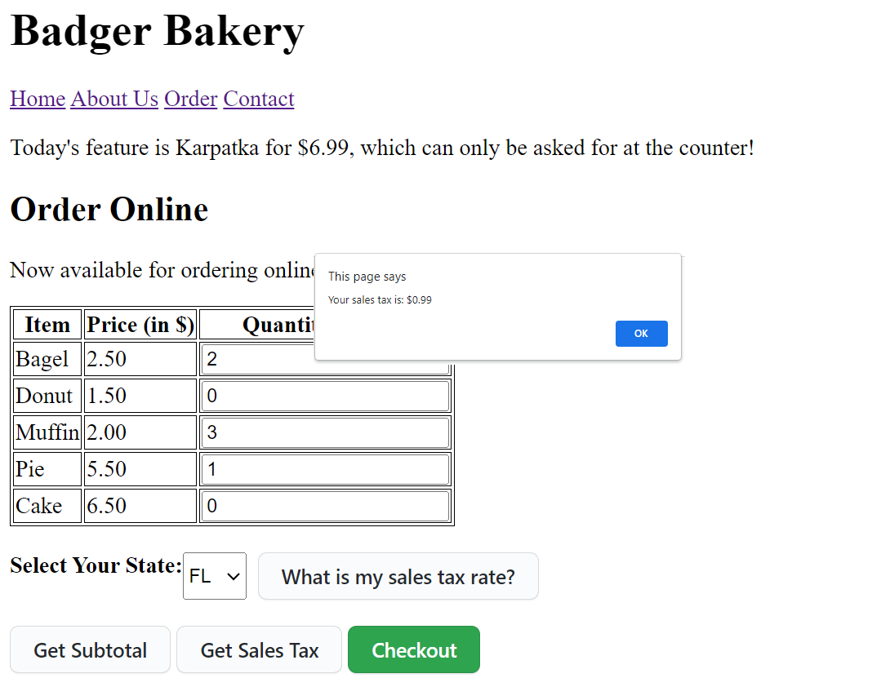
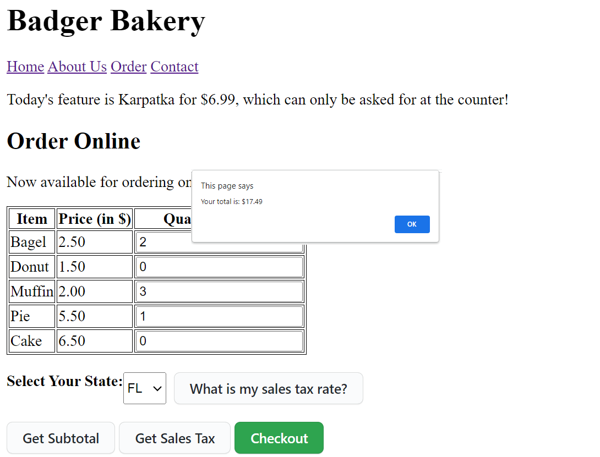
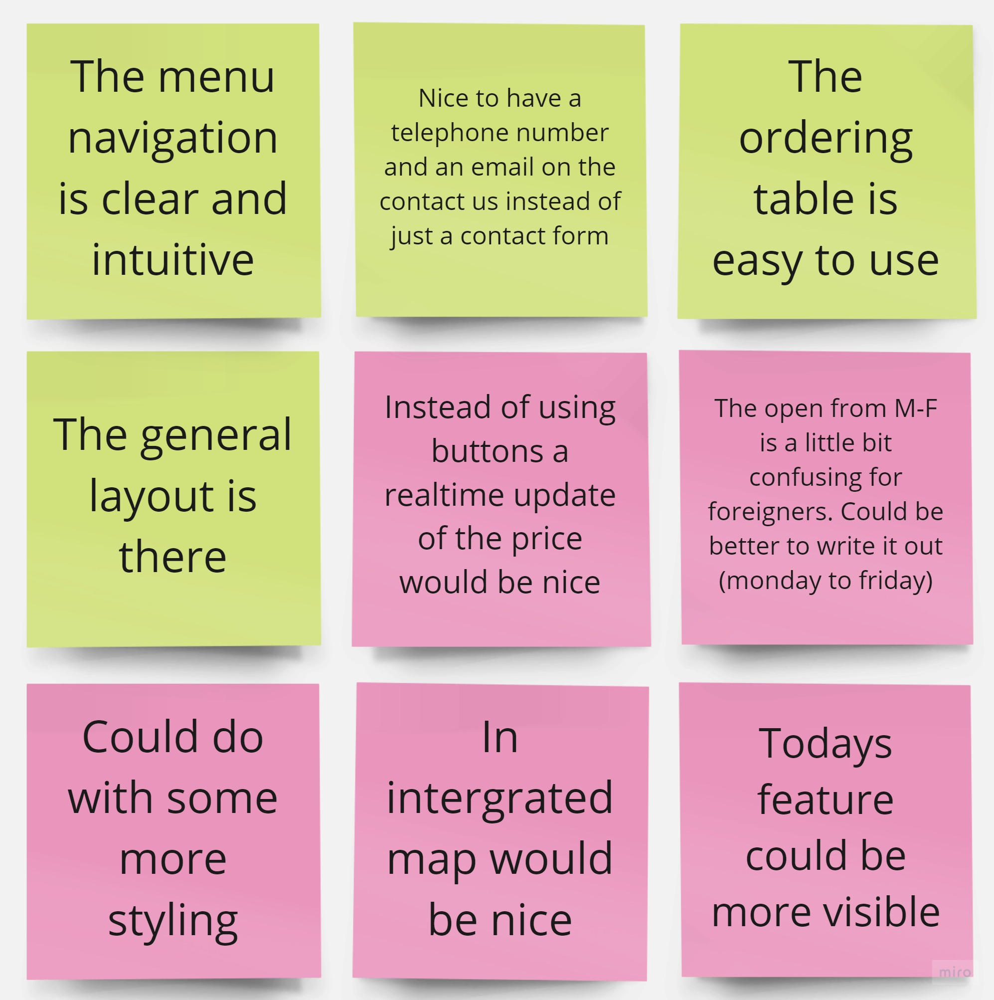
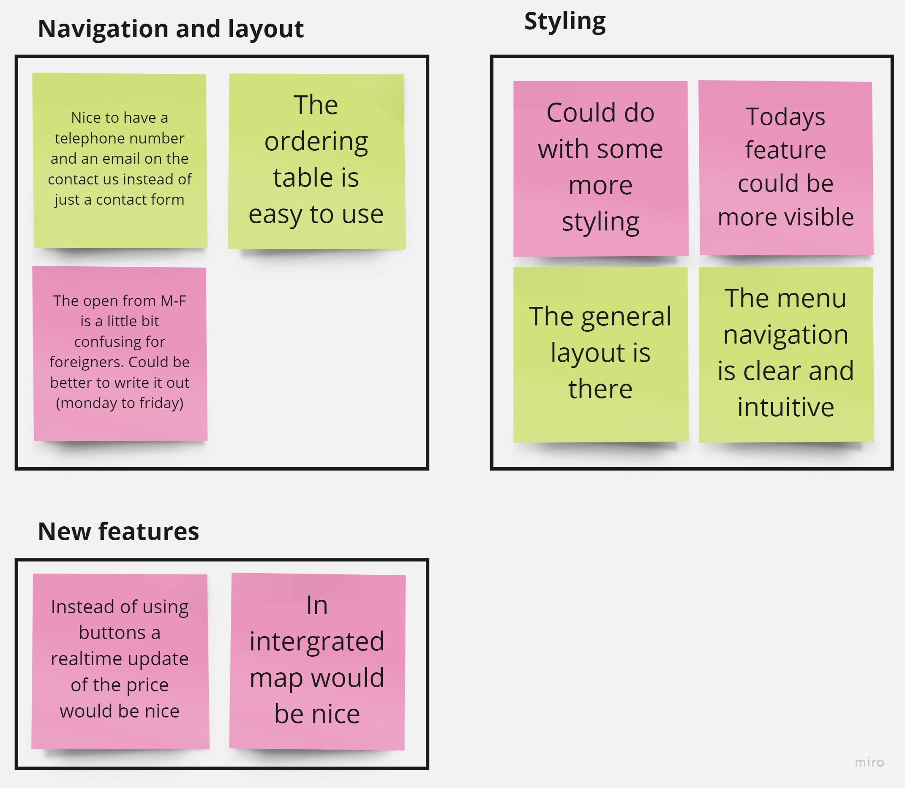

[](https://classroom.github.com/online_ide?assignment_repo_id=11857027&assignment_repo_type=AssignmentRepo)
# CS571-F23 HW1: Badger Bakery

Welcome to Badger Bakery! For this assignment, you will be completing the functionality of the `.html`, `.css`, and `.js` files. You will also be using our first API. Following, you will complete the design thinking process in this `README.md`.  **Make sure to complete all sections.**

## JavaScript Essentials

All `.html`, `.css`, and `.js` files are located in the `badger-bakery` folder. You can load any of the webpages in a web browser. I recommend using [Visual Studio Code](https://code.visualstudio.com/) to do your development work.

### 1. About Us Page

The `about-us.html` page is currently empty. Make a *plausible-looking* About Us page using text generated from [lorem ipsum](https://www.lipsum.com/) (be sure to cite your source with a comment!). On this page, you should use multiple heading levels, **bold** and *italic* text (remember to use the locale-appropriate tags!), and insert the image from `assets/bagel.jpg`. The image must be accessible, so be sure to include an `alt` tag describing what it is! There are no other strict requirements for this section, see the screenshot below for an example.

___


### 2. Button Styling

All of our buttons look the same! However, if you look at the `.html` files, we do distinguish between CSS classes `primary-button` and `secondary-button`. Using `styles.css`, give `primary-button` and `secondary-button` three different CSS attributes (e.g. change the `background-color`, `border`, `padding`, or any other CSS attributes of each). Again, there are no other strict requirements for this section, see the screenshot below for an example.

___


### 3. Getting State Tax

In `order.js`, implement the function `getSalesTaxRateForState`.

When this function is properly implemented, you can get the sales tax for a state by using the "What is my sales tax rate?" button in the browser. 

**Hint:** Use the `SALES_TAX` object to get the tax rate for a particular state.


___

### 4. Calculating Subtotal.

In `order.js`, implement the function `calculateSubtotal`.

Use a `for` loop over the `ITEMS` array in combination with `document.getElementById`. You may *not* hardcode the names of the bakery items! Hardcoding will cause you to lose points.

This function should calculate the sum cost of all baked goods ordered. When this function is properly implemented, you can calculate your subtotal using the "Get Subtotal" button in the browser.

For example, ordering two bagels, three muffins, and one pie should cost $16.50.

Assume inputs will always be positive, whole numbers.

**Hint:** You can get the quantity and price of an item by doing...

```js
const quantity = parseInt(document.getElementById("ITEMNAME-quantity").value);
const price = parseFloat(document.getElementById("ITEMNAME-price").innerText);
```

___




### 5. Calculating Sales Tax

In `order.js`, implement the function `calculateSalesTax`.

You must apply the sales tax rate from `getSalesTaxRateForState` to the amount from `calculateSubtotal`. Use the `roundMoney` function to round to the nearest penny.

When this function is properly implemented, you can calculate your sales tax by using the "Get Sales Tax" button in the browser. 

For example, when ordering two bagels, three muffins, and one pie ($16.50), the Alabama (AL) sales tax should be $0.66 while the Florida (FL) sales tax should be $0.99.

___




### 6. Completing Order

In `order.js` add an event listener that waits for the "Checkout" button to be pressed. When the checkout button is pressed, alert the user what their total bill is (using `calculateSubtotal` and `calculateSalesTax`).

**Note:** We won't learn about APIs until next week's lecture, so we won't make an *actual* transaction. In future assignments, we will learn about using APIs to work with *backends* and make *actual* transactions.

___




### 7. Featured Item
That's all the code you will need to write for HTML, JS, and CSS! This last step is to be sure that you have a working Badger ID.

If you see today's feature at the top, e.g...

```
Today's feature is Sachertorte for $14.99, which can only be asked for at the counter!
```

... there is nothing further you need to do for this section -- **you can continue to the design segment below!** Note the special rotates daily, so you may see a delicious [karpatka](https://en.wikipedia.org/wiki/Karpatka), [pirozhki](https://en.wikipedia.org/wiki/Pirozhki), [basbousa](https://en.wikipedia.org/wiki/Basbousa), [povitica](https://en.wikipedia.org/wiki/Nut_roll), [lamington](https://en.wikipedia.org/wiki/Lamington), [sachertorte](https://en.wikipedia.org/wiki/Sachertorte), or [baklava](https://en.wikipedia.org/wiki/Baklava) depending on the day! 🎂🍪🍩


If you do **not** see today's feature, you will need to search your email for `CS571 - New Badger ID` sent by `ctnelson2@wisc.edu`. Enter this Badger ID (starts with `bid_`) on the course webpage by visiting [cs571.org](https://cs571.org/) > BadgerAuth > Use BadgerID. After submitting, **wait for at least a minute**, and refresh your Badger Bakery page.

If you did not find a Badger ID in your email, you will need to go to [cs571.org](https://cs571.org/) > BadgerAuth > Manage BadgerIDs and issue your own. After issuing a new BadgerID, you will need to follow the steps above to use the BadgerId. After submitting, **wait for at least 10 minutes**, and refresh your Badger Bakery page.

Following these steps, today's special should appear at the top of the order screen. If not, try disabling your extensions, [allowing third party cookies](https://support.google.com/chrome/answer/95647?hl=en&co=GENIE.Platform%3DDesktop#zippy=%2Callow-or-block-cookies-for-a-specific-site) (to cs571.org), or using a different browser. If the issue still persists, please contact course staff.


## Design Thinking 

Complete this part of the assignment *after* your complete the implementation of Badger Bakery. If you are unable to complete the implementation of Badger Bakery, complete this to the best of your ability.

Here, you will complete the *first half* of the 6-step design thinking process: empathizing, defining, and ideating. **Please type your responses in this `.md` file where indicated.** If a response asks you to upload a figure or attachment, include those underneath the `figures` directory. Images can be included using the following markdown format: ``

### 1. Empathize

Pretend that you are a customer of Badger Bakery. What are your thoughts about the Badger Bakery website? What does it do well, and what needs improvement? What is clear, and what is not so clear? Write down 8-12 thoughts or feelings on seperate post-it notes (or use a digital alternative, like [draw.io](https://app.diagrams.net/) or [Miro](https://miro.com/)). **There are no right or wrong answers here.** Include a picture or screenshot of your post-it notes below.



### 2. Define

Now that we have gathered some thoughts, we must make sense of them! Use affinity diagramming to categorize your thoughts.  Refine your groupings iteratively until you have 2-4 categories. Include a picture or screenshot of your affinity diagram below.



### 3. Ideate

Think big. Gaining inspiration from your affinity diagram, what could be changed about the Badger Bakery website? Remember to be creative and outrageous. These ideas don't have to be complete thoughts or sentences, go for quantity over quality (aim for 6-8 ideas). Include one *annotated* sketch of what Badger Bakery could look like.

1. Interactive map showing location
2. Visual journey showing evolution of the bakery since its opening
3. Real time update of prices when ordering. Maybe a box showing visually the different things you are ordering
4. A pop up of todays feature
5. A language select button. Maybe use AI to translate the site
6. A possibility to customize order. Build your own cake. 


### Done!

You have completed the first 3 steps of the design thinking process. 🥳 Next, we would prototype, test, and implement — we'll save those for another time. Double-check your work, and submit your assignment!